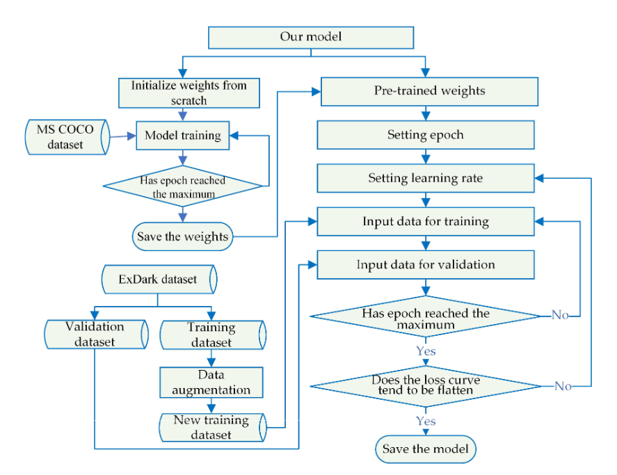

## Training

It comprises the following two primary phases: 
1) pre-
training with a dataset utilized by the original model to obtain the initial weights, and
initialization of our model utilizing the pretrained weights as a starting point. 

2) Subsequently,
the ExDark dataset was subjected to the augmentation methods, preparing to be fed into
our model for formal training.

#### Why? 
The adoption of pretrained weights stems from the following
two rationales: 
1) first, pretraining on a dataset larger than our target dataset reinforces the
model’s underlying network’s capacity for edge feature extraction. 
2) Second, leveraging
pretrained weights accelerates model convergence, thereby reducing the training time on
the target dataset.

